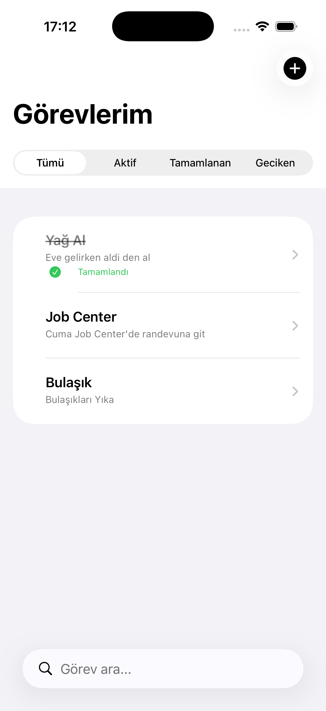
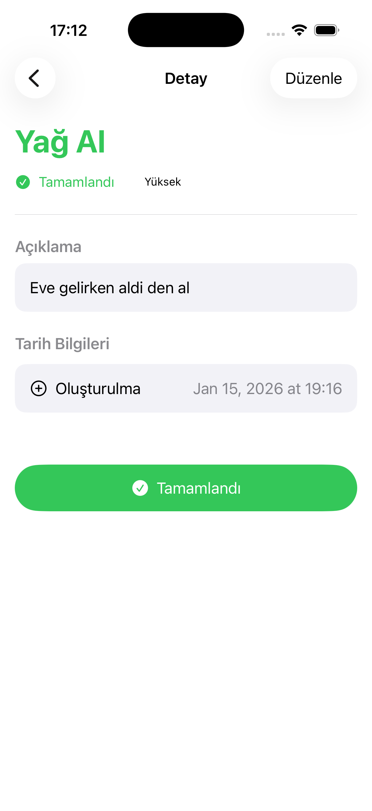
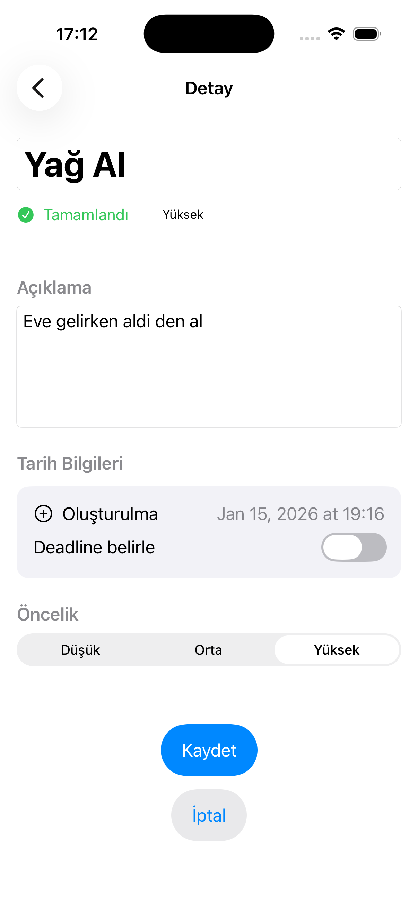
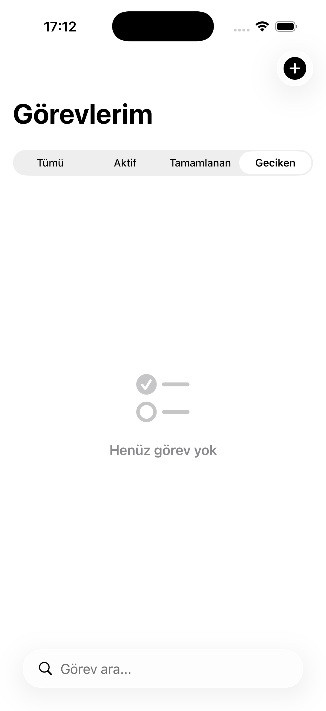

## SwiftUI ToDo App

A simple ToDo application built with SwiftUI while learning and practicing
core SwiftUI concepts. The main focus of this project is understanding state
management, navigation flow, and clean UI structure.

---

## Features
- Add, list, and manage tasks
- SwiftUI native navigation
- List and detail views
- Clean and simple UI

---

## Learning Focus
- `@State` and `@Binding`
- NavigationStack & NavigationLink
- List & Detail views
- Component-based UI structure

---

## Screenshots

  
  

  
  

---

## Technologies
- SwiftUI
- Swift

---

## Notes
AI tools were used as assistants during development.  
The primary goal of this project was learning, experimenting, and improving
code readability and structure.

---

## Author
**Muhammed Yasir Bilir**  
🌐 https://www.yasirbilir.com
